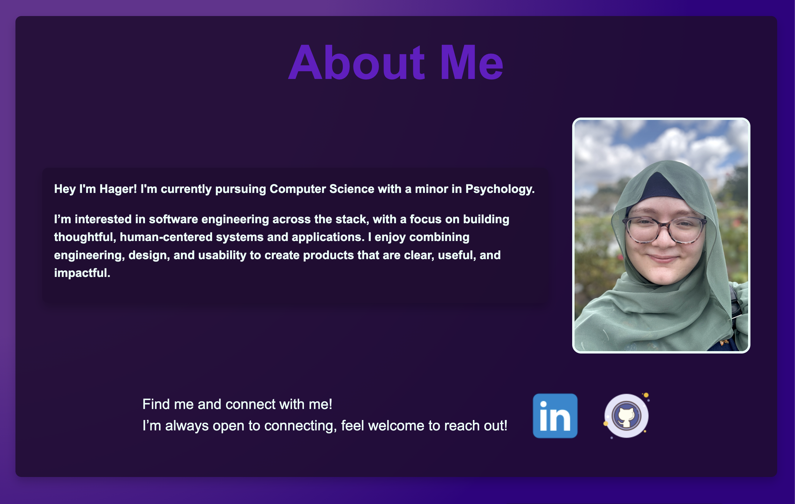

[github]: https://github.com/hagerbahar "Github Profile"

[hagerbahar-profilio]: https://hagerbahar.github.io "Hager Profilio"

# Portfolio | [Live @ hagerbahar.github.io]([hagerbahar-profilio])

| Desktop | Mobile |
| -------------- | --------------- |
|  |  |

# Introduction 

Hager's Profilio Website 

My portfolio is focused on introducing my focus: combining logic, design, and empathy to build clear, usable software.

For this first version, I focused on being clear, engaging, and vibrant.

I decided on core HTML/CSS and Javascript to better focus on foundations and really show the power of core foundations.

### *Key features*
- Elegant layout and design
- Core responsiveness across devices
- Accessible and semantic HTML built-in

Check it out 👉 [Live @ hagerbahar.github.io]([hagerbahar-profilio])

----

#  Planned Improvements 🪐

- Integrated projects section
- Nagivation 
- Writings sections
- Animations with sound
- Light theme!

---

#  Languages/Tech

- HTML
- CSS
- Javascript

⭐ Find more on my [github][github]!
